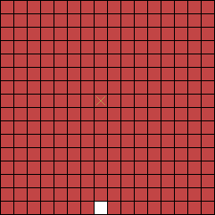
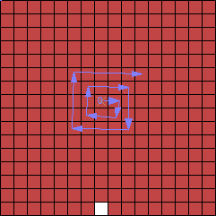
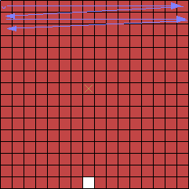

# The Hash Game

This is a simple single-player game and an associated mathematical question. Consider the following game.

Let *S* be an arbitrary string of letters, digits, parentheses, and commas, chosen before the game begins. Then the game begins on a 16x16 board of red tiles. The tiles are indexed by *(x, y)* where *x* and *y* range from *1* to *16*, inclusive. The tile *(8, 8)* is marked with a star, indicating that it is the winning square. The tile *(8, 16)* is a white tile; all other tiles begin red. No tiles begin black.

The player makes the first move. On their turn, the player chooses a red tile that is adjacent to a white tile. That red tile becomes white. The player wins the game if the winning tile becomes white. The player loses the game if the winning tile becomes black, or if it is their turn and there are no valid moves they can make.

On the machine's turn, it will choose a single tile and turn it black, according to the following intentionally cryptic algorithm. Note that, unlike the player, the machine can turn any colored tile black, not just red tiles.

1. Let *x* and *y* be the x and y coordinates of the player's most recent move, written in string form.
2. Count the number of white tiles on the board. Let *t* be the number of white tiles, written in string form.
3. Let *u* be the string *S(x,y)t*. That is, let *u* be the string formed by concatenating the salt *S*, a literal open parenthesis, the coordinate *x*, a literal comma, the coordinate *y*, a literal close parenthesis, and then the value *t*.
4. Starting at the winning square in the middle, form a spiral going outward clockwise (see the image below). Let *m* be the number of consecutive red tiles leading this spiral. If the winning tile is not red, let *m* be *0*.
5. Compute *md5(u)*, the MD5 hash of the string *u*. Take this string as a sequence of *32* individual hexadecimal digits. Let *v* be the sum of these digits. Then let *d* be *v* times *m* (mod *256*)
6. Considering the game board in reading order (see the image below), turn the *d*th tile black.

Spiral order (for counting *m*)

Reading order (for determining the machine's position)

The file `hashgame.hs` is a Haskell program which simulates this game. Invoke `playGame saltString playMoveIO gameBoard` (for some salt string) to play the game interactively, and call `isWinnable saltString` to determine whether the game can be won for this string.

The mathematical question is this: **Does there exist a salt string such that the game is unwinnable?** If so, the `isWinnable` function in the attached source code can verify the correctness of the solution.
